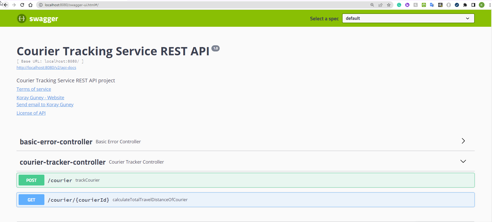
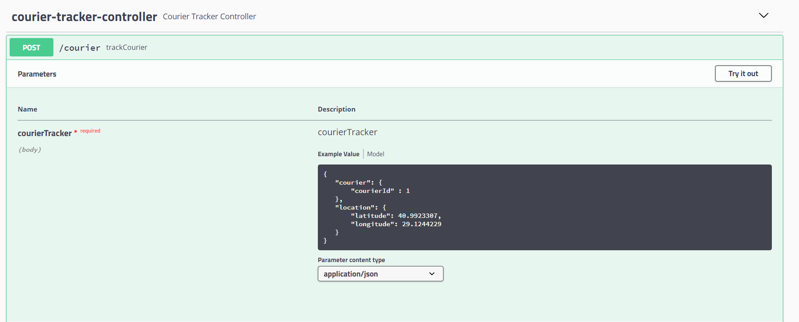
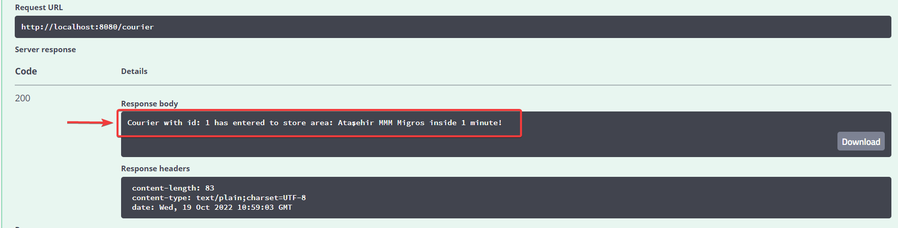
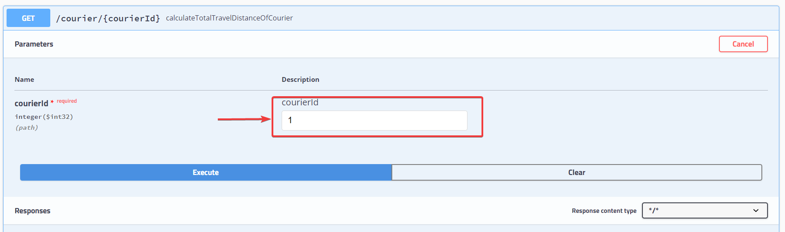
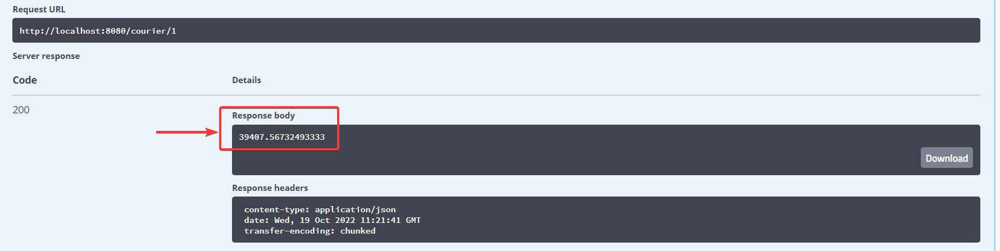
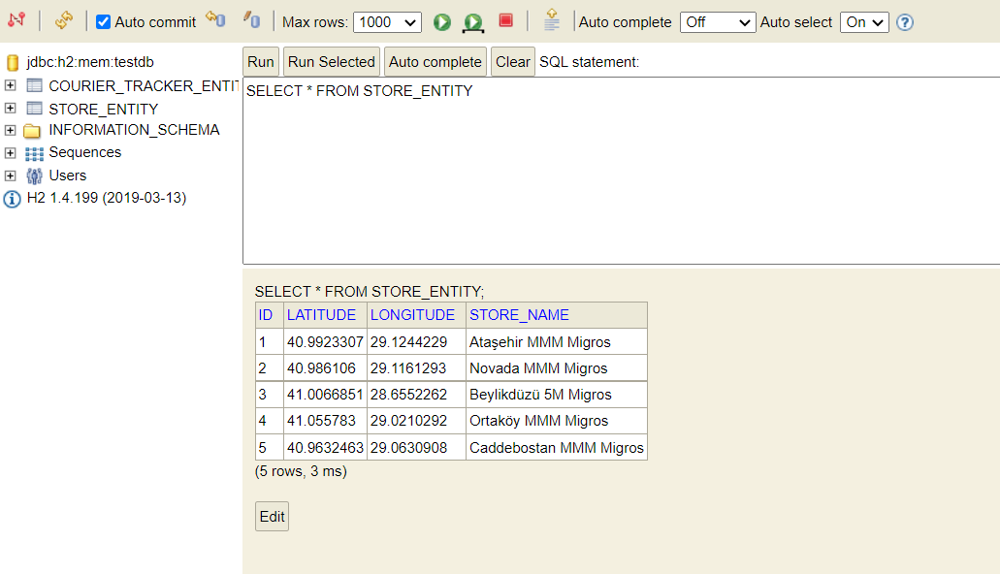

Demo Application for Migros One Company
--------------------------------------
This  application is prepared for the "**Migros One Company**" job task. This application is a simple Courier Tracking service application which is able to track geolocations of couriers.

How to run the project:
-----------------------

On a separate terminal and since this is a maven project you just need to go to the root of the project and perform the command:
```
mvn clean install
```
or if you don't have installed maven on your OS

```
mvnw clean install
```


This will run the unit tests of the project and create the jar file.

After having the jar file you can simply run:

```
java -jar target/migros-one-demo-0.0.1-SNAPSHOT.jar
```

Since this is a Spring Boot project, you can also run the project with below command;
```
mvn spring-boot:run
```

or if you don't have installed maven on your OS
```
mvnw spring-boot:run
```

The project will run on port 8080 (configured as default).


How to test the project:
-----------------------

* You can test the project from Swagger API UI. To access Swagger UI, go to;
* http://localhost:8080/swagger-ui.html

Example screenshot;




According to Migros One task functional requirements;

### Testing Business Rule-1 :
#### 'Log courier and store when any courier enters radius of 100 meters from Migros stores. Reentries to the same store's circumference over 1 minute should not count as "entrance". Store locations are given as stores.json file.';

1. All stores information at below will be saved to DB during application start;
```
[
	{
		"name": "Ataşehir MMM Migros",
		"lat": 40.9923307,
		"lng": 29.1244229
	},
	{
		"name": "Novada MMM Migros",
		"lat": 40.986106,
		"lng": 29.1161293
	},
	{
		"name": "Beylikdüzü 5M Migros",
		"lat": 41.0066851,
		"lng": 28.6552262
	},
	{
		"name": "Ortaköy MMM Migros",
		"lat": 41.055783,
		"lng": 29.0210292
	},
	{
		"name": "Caddebostan MMM Migros",
		"lat": 40.9632463,
		"lng": 29.0630908
	}
]
```
2. Select **/courier** POST method under **courier-tracker-controller** and then **Try it out**, Prepare request body into JSON format and press **Execute**;

   

3. For example; to request a save a customer, prepare a request body like;
```
{
   "courier": {
       "courierId" : 1
   }, 
   "location": {
       "latitude": 40.9923307,
       "longitude": 29.1244229
   }
}
```
4. For valid requests, successful server response (200 Status code) and a Status String will return;
   

5. Possible Status Strings are;

| String                                                                  | Case                                                                                      |
|-------------------------------------------------------------------------|-------------------------------------------------------------------------------------------|
| Courier with id: XX has entered to store area: XXXXXXXX at XXXXXXXXXXXX | Any courier enters radius of 100 meters from Migros stores.                               |
| Courier with id: XX has entered to store area: XXXXXXXX                 | Reentries to the same store's circumference within 1 minute should not count as "entrance" |
| Courier with id: XX is far away from store areas!                       | Any courier is ourside of radius of 100 meters from Migros stores.                        |

### Testing Business Rule-2 :
#### 'The application must provide a way for querying total distances, over which any courier travels.';

1. This courier tracker system only calculate of entries of courier to store areas!
2. **To calculate the total distance of an courier**, Select **/courier/{courierId}** GET method under under **courier-tracker-controller** and then **Try it out**

3. Write valid inputs as Integer (prefer previously stored courier which entered to different store areas!) and press **Execute**,
   
4. Then server response will be displayed with calculated total travel distance (as meters);
   

### Database login

This project is using H2 database to store required data. To access H2 console;
*  http://localhost:8080/h2-console/

After that, login screen will be displayed;



To login, below credentials must be written to login screen and then click **Connect**;

| Part  | Input              |
| ------------- |--------------------|
| Driver Class  | org.h2.Driver      |
| JDBC URL  | jdbc:h2:mem:testdb |
| User Name | sa                 |
| Password  | sa                 |